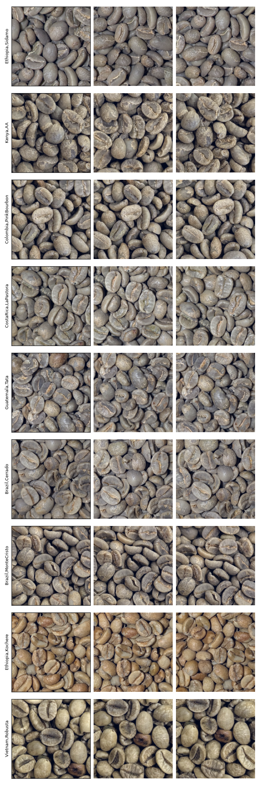

# Coffee Bean CV Classifier

Computer-vision-first classification of coffee bean origin/quality from photos. Camera-only CV is the active approach; a multi-modal hardware sensor rig (NIR spectroscopy, gas sensing, RF dielectric sensing) is documented as a fallback in `hardware/`, only worth building if plain-image CV underperforms.

Sample train patches, one row per class, cropped from the current dataset (`dataset/2026-08-07__box_pictures_all_classes`):



## Repo layout

- `dataset/` — labeled photo captures. Each capture session is its own dated folder (e.g. `2026-07-24__first_pictures/`), tracked with [DVC](#dataset--dvc) rather than committed directly to git. `classes.txt` maps class id → origin/grade/region and is a plain git-tracked text file.
- `hardware/` — sensor datasheets (NIR: AS7263/AS7265x/AS7343, gas: BME688, LEDs) and a design-research writeup (`Computer vision models for coffee bean origin classification - Claude.pdf`) on which physical/chemical signals actually carry origin information. Reference material for the fallback hardware path — nothing here is built or wired up yet.
- `.devcontainer/` — the dev environment (below).
- `.vscode/c_cpp_properties.json` — C/C++ IntelliSense config anticipating firmware work; unused while CV-only is the active path.

## Dev environment

Open in VS Code with the Dev Containers extension ("Reopen in Container"). It builds `Dockerfile.cpu`: Python 3.12, PyTorch (CPU wheels — no NVIDIA GPU on this machine), OpenCV, scikit-learn, DVC, etc. `--device=/dev/dri` passes through this machine's AMD iGPU for OpenCV's OpenCL path; as configured the devcontainer won't start on a host without that device (cloud VM, macOS, NVIDIA-only box) — there's no separate GPU/cloud variant, training happens on this same workstation.

Persisted across rebuilds via named Docker volumes (not part of the repo — a `docker volume prune` or Docker reset would lose them): bash history, Claude Code's config/auth/chat history, and IPython/Jupyter history.

## Dataset & DVC

New capture sessions get tracked with:

```bash
dvc add dataset/<session-name>
git add dataset/<session-name>.dvc dataset/.gitignore
```

This keeps the actual images out of git (only a small `.dvc` pointer + hash gets committed) while still versioning them alongside code.

**No DVC remote is configured yet** — tracked data only lives in the local `.dvc/cache`, so none of it is backed up anywhere yet. Run `dvc remote add -d <name> <url>` (S3/GCS/local NAS/etc.) and `dvc push` before relying on this for anything you can't afford to lose.

## Status

Devcontainer, dataset pipeline, and a patch-based training/eval pipeline (`coffeecv/`) are all in place. Current best result (resnet18, full fine-tune, 700px patches, trained on the 180-photo multi-photo dataset above): test macro-F1 ~0.89-0.91 across a 3-seed check. Full experiment history and reasoning is in `EXPERIMENTS_LOG.md`.
