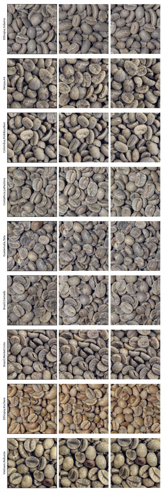

# Coffee Bean CV Classifier

Computer-vision-first classification of coffee bean origin/quality from photos. Camera-only CV is the active approach; a multi-modal hardware sensor rig (NIR spectroscopy, gas sensing, RF dielectric sensing) is documented as a fallback in `hardware/`, only worth building if plain-image CV underperforms.

Sample train patches, one row per class, cropped from the current dataset (`dataset/2026-08-07__box_pictures_all_classes`):



## Repo layout

- `dataset/` — labeled photo captures. Each capture session is its own dated folder (e.g. `2026-07-24__first_pictures/`), tracked with [DVC](#dataset--dvc) rather than committed directly to git. `classes.txt` is a plain git-tracked text file with one line per coffee (class folder), `id;Country[,Region[,Subregion]];Misc`, e.g. `011;Peru,Junin,Satipo;Minca` (ticket ML-3 D15). The model's class is the **country**: several folders of one country train as one class. The farm region and misc are facts about the photos, never labels (`GLOSSARY.md`).
- `coffeecv/` — the training, evaluation and inference code; `coffeecv_dino/` holds the DINOv3 screening tools.
- `models/` — shipped checkpoints (`.pt` via DVC) with their git-tracked cards and OOD sidecars; `models_pretrained/` — upstream backbone weights (untracked) and their checksums.
- `experiments/` — one archived directory per run, plus `experiments/index.csv`.
- `webapp/` — the public web service serving the shipped classifier (see [Web service](#web-service) below).
- `scripts/` — the deploy (`deploy_webapp.sh`) and the remote-sweep toolkit (`remote_launch.sh`, `remote_watch.sh`, `remote_wait.sh`).
- `docs/` — plans, investigations and their records.
- `hardware/` — sensor datasheets (NIR: AS7263/AS7265x/AS7343, gas: BME688, LEDs) and a design-research writeup (`Computer vision models for coffee bean origin classification - Claude.pdf`) on which physical/chemical signals actually carry origin information. Reference material for the fallback hardware path — nothing here is built or wired up yet.
- `.devcontainer/` — the dev environment (below).
- `.vscode/c_cpp_properties.json` — C/C++ IntelliSense config anticipating firmware work; unused while CV-only is the active path.

## Dev environment

Open in VS Code with the Dev Containers extension ("Reopen in Container"). It builds `Dockerfile.cpu`: Python 3.12, PyTorch (CPU wheels — no NVIDIA GPU on this machine), OpenCV, scikit-learn, DVC, etc. `--device=/dev/dri` passes through this machine's AMD iGPU for OpenCV's OpenCL path; as configured the devcontainer won't start on a host without that device (cloud VM, macOS, NVIDIA-only box) — there's no separate GPU/cloud variant. Long training sweeps run on a separate CPU VM (`scripts/remote_launch.sh`), the same box that serves the web app.

`scripts/check.sh` is the guardrail: `coffeecv.leak_check` (no public IPs, emails, credentials or photo GPS in what git would publish), `coffeecv.ticket_check` (the HTML tickets, plans and ADRs keep the tracker's rules), `ruff check` (the lint rules in `pyproject.toml`'s `[tool.ruff]`), `coffeecv.coverage_report` and the unittest suite, in two tiers. `.githooks/pre-commit` runs the leak check alone on staged files before every commit. The fast tier (~30 s) skips the tests marked `@real_data` in `tests/_tiers.py` (real photos or real weights); `.githooks/pre-push` runs it before every push to origin, pushes to the VM skip it, and `git push --no-verify` bypasses it once. `scripts/check.sh --full` (~4.5 min) runs every test; `scripts/deploy_webapp.sh` runs it on the commit it deploys, before touching the VM. The devcontainer wires the hook (`git config core.hooksPath .githooks`); on a fresh clone outside it, run that command yourself.

Persisted across rebuilds via named Docker volumes (not part of the repo — a `docker volume prune` or Docker reset would lose them): bash history, IPython/Jupyter history and the uv cache. Two gitignored folders in the workspace itself (a bind mount from the host) persist too: `.private_claude/`, mounted as Claude Code's config directory (auth, sessions, memory), and `.private_ssh/`, the devcontainer's SSH keys and config. `~/.ssh` is a link to `.private_ssh/`, so the SSH config with the VM's host alias, its key and `known_hosts` survive a rebuild too; `.devcontainer/link-private-ssh.sh` makes the link on container create, and also sets this clone's `git config core.sshCommand` to push with the devcontainer's key, `.private_ssh/coffee-vision-devcontainer`.

## Dataset & DVC

New capture sessions get tracked with:

```bash
dvc add dataset/<session-name>
git add dataset/<session-name>.dvc dataset/.gitignore
```

This keeps the actual images out of git (only a small `.dvc` pointer + hash gets committed) while still versioning them alongside code.

The default remote is `powervpsssh`, an SSH remote configured in `.dvc/config`: `/home/alioth/dvc-store` on the VM, reached through the `powervpsssh` SSH host alias. On the VM itself, `.dvc/config.local` points the same remote at that folder as a local path. `dvc push` backs the cache up there. The old remote, `remoteconfig` (down since 2026-09-24), is kept in the config but is not the default. Verify a push by checking that the objects `dvc.lock` names exist on the remote, not by `dvc status --cloud`'s summary, which can report "in sync" while objects are missing.

## Web service

`webapp/` serves the shipped checkpoint, `allrigs_dino3b16_seg_country_s123` (a frozen DINOv3 ViT-B/16 with a
fitted linear head, on segmenter crops), behind `POST /classify` plus a one-page frontend: upload a photo, get
scores for all 10 countries, or a refusal when the photo does not look like the training data (the OOD guard). It wraps
`coffeecv.infer` rather than reimplementing any of it, so the CLI and the web service can never silently
disagree. Production runs from an immutable release under `/opt/coffee-cv` with its own uv environment,
isolated from the training checkout; a deploy is one command, `scripts/deploy_webapp.sh`. See
`webapp/README.md` for the architecture, deploy and rollback, and the things (domain, TLS cert) that live
outside git by design.

## Status

Devcontainer, dataset pipeline, and a patch-based training/eval pipeline (`coffeecv/`) are all in place. Training draws from four capture dirs (`data/segcropped/cam_*`, one per camera, cut by the segmenter; the tray heuristic's `data/cropped` pools were retired in ticket ML-3), pools their photos, and splits them 70/15/15 within each class. Since ticket ML-1 (2026-09-29, `docs/ticket_retire_cross_rig.html`) all cameras are equal: none is held out, and the only label is the bean class. Val patch macro-F1 selects checkpoints and adoptions (ML-1 D3 also moves the DINOv3 head's C onto it from the next fit; `fit_frozen_head.py` does not do that yet); test is reported. The cross-camera figures below come from the leave-one-camera-out folds that ML-1 retired.

- **Shipped: frozen DINOv3 ViT-B/16, `cls_mean` readout, logistic-regression head**, no TTA. Cross-camera patch macro-F1 **0.8873** (exp240-251, 3 seeds × 4 folds), 0.9489 pooled per photo. The owner selected it on those folds and it has been live since 2026-09-27; the formal paired comparison against ResNet18 (`docs/dinov3_integration_plan.md` §7.2) was closed as superseded when ML-1 retired the folds (D7). The model in `models/`, `allrigs_dino3b16_seg_country_s123` (exp262, live since 2026-10-06), is that recipe on segmenter crops with country classes: in-distribution val 0.9790, test 0.9683.
- **Fine-tuned ResNet18 recipe** (bean-unit patch sizing at 4-7 beans, MixStyle p=0.5, random erasing p=0.5, 100 epochs / patience 20, TTA): cross-camera **0.7908-0.8025** over seeds 42, 123 and 7 (exp200-203, exp232-239). No ResNet18 model ships any more.

`models/` holds only the current release. Every older model (`allrigs_cam_s123`, `allrigs_dino3b16_s123`, `allrigs_dino3b16_seg_s7` and the `phase*`/`allrigs_*_s17` ResNets) was retired on 2026-10-06; its card, sidecars and `.pt.dvc` are in git history and its `.pt` in the DVC cache and remote.

Quote ranges over seeds, not a single run: seed-to-seed spread is wider than most of the effects being measured, which is why adoptions require a *paired* multi-seed check.

**Every val and test score this pipeline now produces is in-distribution, not an estimate of real-world accuracy.** Val and test photos come from the same bean bags and the same cameras as the training photos, so they say nothing about how a model does on a new camera or a new scoop of beans (ML-1, R2). They also sit near ceiling (~0.97) and barely separate choices (R1). Never compare one with a fold-era cross-camera number: 0.887 and 0.975 for the same shipped model answer different questions (R3), and `experiments/index.csv` keeps the two kinds of column apart (`xrig_*` is blank for runs since ML-1, meaning "not measured"). Until a generalization test set exists (fresh scoops, a new phone -- its own ticket), camera- or scoop-level drift shows up only in manual spot-checks and the OOD guard, and neither gates a change.

Full experiment history is in `EXPERIMENTS_LOG.md`. Phases 1-14 (through exp105) were written contemporaneously and are authoritative prose. Phases 15-17 (exp106-175) were **reconstructed on 2026-09-03** from `index.csv` and the archived configs — the numbers are recomputed and exact, but the reasoning-as-it-happened is genuinely lost for those runs, and the section says so. Per-experiment metrics, configs, curves and predictions are archived in `experiments/` — see `experiments/README.md`; `experiments/index.csv` is the one-row-per-run summary and is regenerated from the archive directories by `archive_experiment.rebuild_index()`, never hand-edited.

Ticket ML-1 and its implementation plan (`docs/ticket_retire_cross_rig.html`, `docs/plan_retire_cross_rig.html`) record how and why the fold protocol was retired. `docs/dinov3_integration_plan.md` is the record of the DINOv3 work; the dataset and rig reorganisation behind the camera-rig numbers is `docs/dataset_training_reorg_plan.md`.

Known limitation worth reading before further tuning: the validation set is saturating (5 of 9 classes sit at or near f1=1.000, and one run hit val macro-F1 0.9917). Since `best.pt` is selected on peak val macro-F1, this degrades *checkpoint selection*, not just reporting — see the Phase 8 summary.
